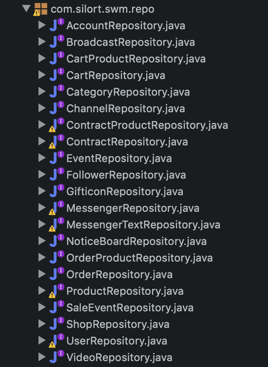

# DongNeBangNe Server

##소스코드 설명

DongNeBangNe Server 는 Springboot 환경에서 제작되었고, 철저한 MVC 패턴을 유지하고 있다.
AWS EC2에 패키징되어 배포되고있다.

## IDE
- STS 4.0

## Dependency
- Lombok
- Gson
- JPA
- Hibernate
- SLF4J
- Databind
- Validator
- Mysql-Connector-Java-8.0.16
- Javassist
- Apache tiles

## License
- Apache 2.0

## Structure 
</img>

## Code Description 
>~/config
>>프로젝트 설정 정보를 담은 클래스들이 들어가있다. 
</img>

>~/model
>>프로젝트에서 다루는 Model 클래스들이 들어가있다. 
</img>

>~/controller
>>실질적으로 view에 넘여줄 데이터들을 가공 및 정의해주는 클래스들이 들어있다. 
</img>

>~/repository
>>CrudRepository Interface를 상속받은 Interface 들이 들어가있고
  DB에 접근하는 기본적인 쿼리들을 제공해준다. 
</img>

### 각 model, controller, repository 는 1:1:1 관계를 가지고있다.
>Model : User / Controller : UserController / Repository : UserRepository

## Issues
>MySQL Cascade
>>정보 수정 시 수정되지 말아야 할 [ ex)로그 Table ] 도 함께 바뀌는 문제 발생
>>>mysql의 제공하지않는 cascade 문제로 인해 모든 테이블의 연관관계를 끊고 일일히 수정

>JPA
>>Query 문 중 select 절에 서브쿼리를 지원하지 않는 문제 발견
>>>Model에 @Transient로 필요한 컬럼이 담긴 객체를 return시 채우는 방식으로 해결

>JPA
>>Date Type의 컬럼을 '>', '<', contains 할 수 없는 문제 발생
>>>JPA 측에서 제공해주는 Date type의 컬럼 비교 메소드를 이용
